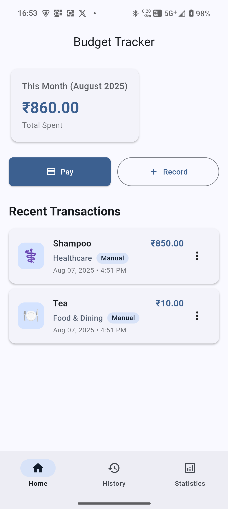
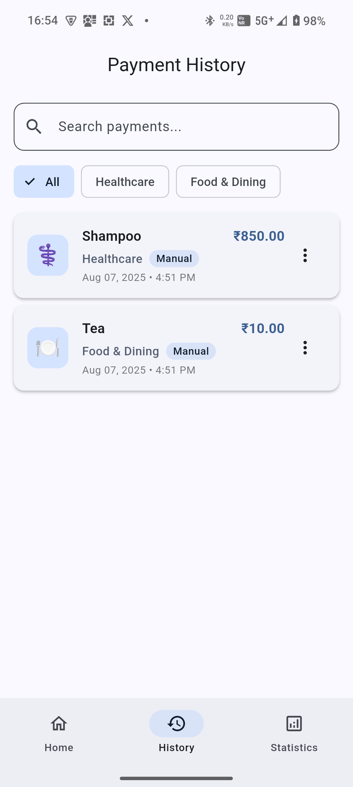
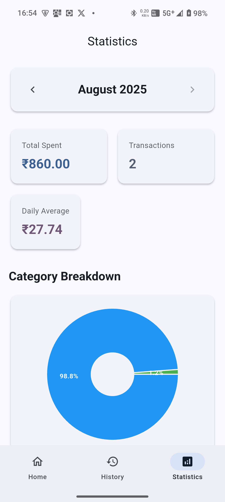

# 💰 Expense Tracker – Smart Budget Tracker for Android


**SpendWise** is a simple, intuitive budget tracking app built with **Flutter** that helps you record expenses, view payment history, track monthly spending, and initiate UPI payments — all while keeping your data private and secure on your device.

> No backend. No ads. No internet required. Just smart, local expense tracking.

---

## 📱 Features

✅ **Manual Payment Logging**  
Easily record payments you've already made with amount, description, category, and date.

✅ **"Pay" Button with UPI Guidance**  
Enter an amount and description, then get a prompt to open your preferred UPI app (like Google Pay, PhonePe, or Paytm) — no forced deep links.

✅ **Monthly Statistics & Insights**  
Visualize your spending with charts and summaries:
- Total spent per month
- Category-wise breakdown (pie chart)
- Daily average
- Transaction count

✅ **History & Navigation**  
Browse all your past transactions with full filtering by month and category.

✅ **Offline-First & Secure**  
All data is stored locally using **Hive**, so your financial info never leaves your phone.

✅ **Beautiful UI with Dark Mode**  
Clean, modern Material Design interface with smooth navigation via bottom tabs.

---

## 🖼️ Screenshots (Preview)

| Home | History | Statistics |
|------|--------|------------|
|  |  |  |

> *Note: Screenshots to be added. Replace paths with actual images in `/screenshots` folder.*

---

## 🚀 Getting Started

### Prerequisites
- [Flutter SDK](https://flutter.dev/docs/get-started/install ) (v3.0 or higher)
- Android Studio or VS Code with Flutter plugin
- An Android emulator or physical device

### Installation

1. Clone the repository:
```bash
git clone https://github.com/your-username/spendwise.git 
cd spendwise