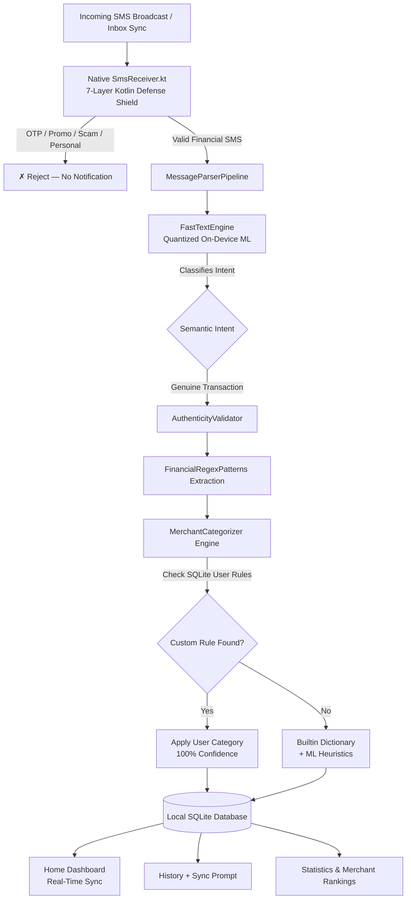

# Expense Tracker

**Privacy-first, on-device ML-powered expense tracking for Indian financial SMS (UPI • Cards • Banks)**

[](https://docs.flutter.dev)
[](https://github.com/allwin-antony/Expense_tracker/releases)
[](LICENSE)
[](https://developer.android.com)
[](#on-device-fasttext-ml-engine)
[](#privacy--architecture)
[](#testing)

Expense Tracker is a modern Android application designed to parse financial SMS messages and automatically categorize transactions. It utilizes a quantized on-device FastText model written entirely in Dart to extract merchant, amount, and account details with zero cloud dependency and strict data privacy.

---

## Table of Contents

- [Why This Project](#why-this-project)
- [Key Features](#key-features)
- [Privacy & Architecture](#privacy--architecture)
- [System Architecture](#system-architecture)
- [On-Device FastText ML Engine](#on-device-fasttext-ml-engine)
- [Technology Stack](#technology-stack)
- [Getting Started](#getting-started)
- [Build & Release](#build--release)
- [Testing](#testing)
- [Contributing](#contributing)
- [License](#license)

---

## Why This Project

Traditional expense tracking applications often suffer from two major drawbacks: manual entry is tedious, and cloud-based automated tracking compromises user privacy. This project addresses both issues:

- **Automated Tracking:** Transactions are captured automatically from financial SMS messages (UPI, cards, net banking, EPFO, mutual funds).
- **Strict Data Privacy:** All parsing and ML inference operations occur on-device. There is no backend, no analytics SDK, and no remote API.
- **Localized for India:** The system is explicitly trained and tested against Indian banking formats (HDFC, SBI, ICICI, Axis) and over 92 NPCI UPI handles.

---

## Key Features

### Intelligent Classification

- **Quantized on-device FastText classifier** (pure Dart): Classifies each SMS as `GENUINE_TRANSACTION`, `PROMOTIONAL_SPAM`, `OTP_SECURITY`, or `INFORMATIONAL` in under 0.3 ms per message.
- **Optimized Model Size:** 171.5 KB model size (an 83.5% reduction from the unquantized version) utilizing uint8 Base64 quantization.
- Automated filtering of loan advertisements, phishing attempts, and OTP codes to ensure notifications remain relevant.

### Native 7-Layer SMS Defense Shield

- A background Kotlin receiver (`SmsReceiver.kt`) featuring full regex-pipeline parity with the Dart parser. This module rejects spam before the Flutter engine initializes, achieving a decision time of under 0.1 ms.
- Verified TRAI sender-header checks restrict processing to genuine financial alerts.

### Adaptive Notifications

- Theme-aware floating AppToast banners featuring fade/slide transitions and interactive UNDO actions.
- Heads-up notifications supporting Exclude and Delete actions, which sync directly to the UI without requiring manual refreshes.

### Deep Transaction Parsing

- **Multi-tier regex pipeline:** Incorporates a `ClauseSemanticScoper` to isolate extraction to the relevant transaction clause, preventing confusion between account balances and transaction amounts.
- **Multi-currency Support:** Capable of processing ₹, $, £, and €, supporting international subscriptions and travel expenses.
- **Extensive Compatibility:** Trained to recognize over 712 RBI-recognized banks and 92 NPCI UPI/AutoPay handles (e.g., `@ybl`, `@okaxis`, `@okhdfcbank`, `@apl`, `@jupiteraxis`).

### Adaptive Learning

- **Custom merchant rules:** Users can map merchants to categories (e.g., "Sharma Dhaba" to "Food & Dining"). The application automatically applies these rules to future and synced SMS entries. User rules take absolute precedence.
- **Custom categories:** Users may create personalized expense and income categories, complete with colors and icons, persistently stored via SQLite.

### Analytics & User Experience

- Interactive pie charts and top-merchant rankings, detailing order frequency and spending distribution, powered by `fl_chart`.
- **Public Privacy Mode:** A one-tap toggle masks financial balances across the Home, Statistics, and History screens.
- **History sync prompts:** Detects limited history availability (1–3 months) and offers quick expansion options (Last 90 Days, This Year, All Time).
- Precise timestamps and date-tagged grouping headers for clear historical context.

---

## Privacy & Architecture

> **User financial data is strictly confined to the local device.**

| Property                   | Guarantee                         |
| -------------------------- | --------------------------------- |
| Cloud servers              | None                              |
| Remote APIs                | None                              |
| Native C++/Python binaries | None                              |
| Third-party analytics      | None                              |
| Storage                    | Local SQLite (`sqflite`) only     |
| ML inference               | On-device, < 0.3 ms per SMS       |

The entire data pipeline—receipt, filtering, classification, parsing, categorization, and storage—executes securely and locally on the user's device.

---

## System Architecture


```mermaid
flowchart TD
    A[Incoming SMS Broadcast / Inbox Sync] --> B[Native SmsReceiver.kt<br/>7-Layer Kotlin Defense Shield]
    B -->|OTP / Promo / Scam / Personal| C[✗ Reject — No Notification]
    B -->|Valid Financial SMS| D[MessageParserPipeline]

    D --> E[FastTextEngine<br/>Quantized On-Device ML]
    E -->|Classifies Intent| F{Semantic Intent}

    F -->|Genuine Transaction| G[AuthenticityValidator]
    G --> H[FinancialRegexPatterns Extraction]
    H --> I[MerchantCategorizer Engine]
    I -->|Check SQLite User Rules| J{Custom Rule Found?}

    J -->|Yes| K[Apply User Category<br/>100% Confidence]
    J -->|No| L[Builtin Dictionary<br/>+ ML Heuristics]

    K --> M[(Local SQLite Database)]
    L --> M

    M --> N[Home Dashboard<br/>Real-Time Sync]
    M --> O[History + Sync Prompt]
    M --> P[Statistics & Merchant Rankings]
```

---

## On-Device FastText ML Engine

A pure-Dart FastText implementation eliminating the need for Python, C++, or TensorFlow dependencies during inference and training.

| Specification      | Details                                                                    |
| ------------------ | -------------------------------------------------------------------------- |
| Classes            | `GENUINE_TRANSACTION`, `PROMOTIONAL_SPAM`, `OTP_SECURITY`, `INFORMATIONAL` |
| Feature extraction | 3–6 char subword n-grams, FNV-1a 32-bit hashing into 8,192 buckets         |
| Quantization       | uint8 Base64 with `embMin` / `embMax` scaling                              |
| Model size         | **171.5 KB** (reduced from 1.03 MB)                                        |
| Inference latency  | **< 0.3 ms** per message                                                   |

**Why FastText?** Subword n-grams render the model highly robust against merchant-name typographical errors, concatenated UPI handles, and unknown senders—accurately reflecting the realities of SMS traffic.

---

## Technology Stack

| Layer         | Technology                                                                        |
| ------------- | --------------------------------------------------------------------------------- |
| Framework     | Flutter `^3.8.1`                                                                  |
| Languages     | Dart & Kotlin                                                                     |
| Database      | `sqflite` (SQLite v5 schema supporting custom merchant rules)                     |
| Charts        | `fl_chart`                                                                        |
| SMS access    | `flutter_sms_inbox` + `permission_handler`                                        |
| Notifications | Custom AppToast overlay + `flutter_local_notifications`                           |
| ML            | Custom pure-Dart FastText (subword hashing, SGD embeddings, uint8 quantization)   |

---

## Getting Started

### Prerequisites

- [Flutter SDK](https://docs.flutter.dev/get-started/install) `>= 3.8.1`
- Android Studio or VS Code with the Flutter extension installed
- An Android device or emulator running Android 5.0 (API level 21) or higher

### Setup

```bash
# 1. Clone the repository
git clone https://github.com/allwin-antony/Expense_tracker.git
cd Expense_tracker

# 2. Install dependencies
flutter pub get

# 3. Run the application
flutter run
```

> **Note:** Upon the initial launch, you must grant SMS permissions to allow the application to synchronize financial messages. All subsequent processing is fully automated.

---

## Build & Release

```bash
flutter build apk --release --split-per-abi
```

| Target                     | Output                                                      |
| -------------------------- | ----------------------------------------------------------- |
| ARM 64-bit (`arm64-v8a`)   | `build/app/outputs/flutter-apk/app-arm64-v8a-release.apk`   |
| ARM 32-bit (`armeabi-v7a`) | `build/app/outputs/flutter-apk/app-armeabi-v7a-release.apk` |
| x86 64-bit (`x86_64`)      | `build/app/outputs/flutter-apk/app-x86_64-release.apk`      |
| Universal APK              | `build/app/outputs/flutter-apk/app-release.apk`             |
| App Bundle                 | `build/app/outputs/bundle/release/app-release.aab`          |

Release builds leverage Java 11 desugaring and icon tree-shaking to minimize binary footprint.

---

## Testing

Execute the test suite using the following command:

```bash
flutter test
```

Expected output:

```text
00:05 +202: All tests passed!
```

Test coverage includes: FastText inference accuracy, Clause Semantic Scoping, TRAI header validation, SMS parser pipelines, custom merchant rule application, merchant analytics aggregation, budget calculations, and date utilities.

---

## Contributing

Contributions are strongly encouraged. For significant architectural changes or new features, please open an issue first for discussion.

1. Fork the repository
2. Create a feature branch (`git checkout -b feat/your-feature`)
3. Commit your changes (`git commit -m 'feat: add specific feature'`)
4. Push to the branch (`git push origin feat/your-feature`)
5. Open a Pull Request (ensure `flutter test` executes without errors)

---

## License

Distributed under the **Apache License 2.0**. See [`LICENSE`](LICENSE) for complete details.

---

<p align="center">
  Developed for secure, private financial tracking.<br>
  Please consider starring this repository if you find it beneficial.
</p>
