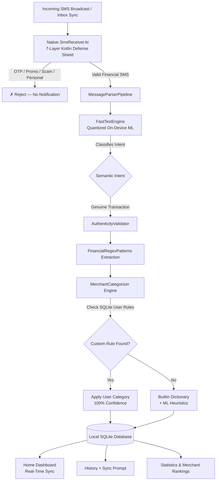

# 💸 Expense Tracker

**Privacy-first, on-device ML-powered expense tracking for Indian financial SMS (UPI • Cards • Banks)**

[](https://docs.flutter.dev)
[](https://github.com/allwin-antony/Expense_tracker/releases)
[](LICENSE)
[](https://developer.android.com)
[](#-on-device-fasttext-ml-engine)
[](#-privacy--architecture)
[](#-testing)

Expense Tracker is a modern Android app that reads financial SMS, classifies them with a **quantized on-device FastText model written entirely in pure Dart**, extracts merchant, amount, and account details, and turns them into categorized transactions — with **zero cloud calls and zero data leaving the device**.

---

## 📑 Table of Contents

- [Why This Project](#-why-this-project)
- [Key Features](#-key-features)
- [Privacy & Architecture](#-privacy--architecture)
- [System Architecture](#system-architecture)
- [On-Device FastText ML Engine](#-on-device-fasttext-ml-engine)
- [Technology Stack](#-technology-stack)
- [Getting Started](#-getting-started)
- [Build & Release](#-build--release)
- [Testing](#-testing)
- [Contributing](#-contributing)
- [License](#-license)

---

## 🌟 Why This Project

Expense tracking apps usually fail for one of two reasons: manual entry is tedious, or cloud-based auto-tracking compromises privacy. Expense Tracker solves both:

- **No manual entry** — transactions are auto-captured from financial SMS (UPI, cards, net banking, EPFO, mutual funds).
- **No privacy trade-off** — all parsing and ML inference happens on-device. There is no backend, no analytics SDK, no remote API.
- **Indian-first** — trained and tested against Indian bank formats (HDFC, SBI, ICICI, Axis) and 92+ NPCI UPI handles, not just generic card-sms formats.

---

## 🔑 Key Features

### 🤖 Intelligent Classification

- **Quantized on-device FastText classifier** (pure Dart): classifies each SMS as `GENUINE_TRANSACTION`, `PROMOTIONAL_SPAM`, `OTP_SECURITY`, or `INFORMATIONAL` in **&lt; 0.3 ms** per message.
- **171.5 KB model** — 83.5% smaller than the unquantized version via uint8 Base64 quantization.
- Loan ads, phishing, and OTP codes are filtered out automatically, so you're only ever notified about real transactions.

### 🛡️ Native 7-Layer SMS Defense Shield

- A background Kotlin receiver (`SmsReceiver.kt`) with **100% regex-pipeline parity** to the Dart parser rejects spam _before_ the Flutter engine even wakes up — **&lt; 0.1 ms** decision time.
- Verified TRAI sender-header checks ensure only genuine financial alerts get through.

### 🔔 Adaptive Notifications

- Theme-aware floating **AppToast** banners with 250 ms fade/slide transitions and interactive **`UNDO`** pills.
- Heads-up notifications with **`🔕 Exclude`** / **`🗑️ Delete`** actions, synced live to the UI without manual refresh.

### 🧾 Deep Transaction Parsing

- **Multi-tier regex pipeline** with a `ClauseSemanticScoper` that isolates extraction to the transaction clause — no more confusing your _balance_ with the _transaction amount_.
- **Multi-currency**: ₹, $, £, € — handles international subscriptions (AWS, Netflix, OpenAI) and travel spend.
- **712+ RBI-recognized banks** and **92+ NPCI UPI/AutoPay handles** in the training dataset (`@ybl`, `@okaxis`, `@okhdfcbank`, `@apl`, `@jupiteraxis`, …).

### 🛍️ Learns From You

- **Custom merchant rules** — map _"Sharma Dhaba"_ → _"Food & Dining"_ once; the app auto-applies it forever, in both SMS syncs and manual entries. User rules take **100% precedence**.
- **Custom categories** — create your own expense/income categories with colors and material icons, persisted in SQLite.

### 📊 Analytics & UX

- `fl_chart`-powered **pie charts by category** and **top-merchant rankings** with 🥇🥈🥉 badges, order frequency, and spending share.
- **Public Privacy Mode** — 1-tap eye toggle to mask balances (`+₹ ••••••`) on Home, Statistics, and History.
- **History sync prompts** — detects shallow history (1–3 months) and offers one-tap expansion to _Last 90 Days / This Year / All Time_.
- Detailed timestamps (`d MMM, h:mm a`) and date-tagged headers (`Today • 14 Aug`).

---

## 🔒 Privacy & Architecture

&gt; **Your money data never leaves your phone.**

| Property                   | Guarantee                         |
| -------------------------- | --------------------------------- |
| Cloud servers              | ❌ None                           |
| Remote APIs                | ❌ None                           |
| Native C++/Python binaries | ❌ None                           |
| Third-party analytics      | ❌ None                           |
| Storage                    | 📁 Local SQLite (`sqflite`) only  |
| ML inference               | 🧠 On-device, &lt; 0.3 ms per SMS |

The entire pipeline — receipt, filtering, classification, parsing, categorization, storage — runs locally on the device.

---

## System Architecture 🏗️


```mermaid
flowchart TD
    A[Incoming SMS Broadcast / Inbox Sync] --> B[Native SmsReceiver.kt<br/>7-Layer Kotlin Defense Shield]
    B -->|OTP / Promo / Scam / Personal| C[✗ Reject — No Notification]
    B -->|Valid Financial SMS| D[MessageParserPipeline]

    D --> E[FastTextEngine<br/>Quantized On-Device ML]
    E -->|Classifies Intent| F{Semantic Intent}

    F -->|Genuine Transaction| G[AuthenticityValidator]
    G --> H[FinancialRegexPatterns Extraction]
    H --> I[MerchantCategorizer Engine]
    I -->|Check SQLite User Rules| J{Custom Rule Found?}

    J -->|Yes| K[Apply User Category<br/>100% Confidence]
    J -->|No| L[Builtin Dictionary<br/>+ ML Heuristics]

    K --> M[(Local SQLite Database)]
    L --> M

    M --> N[Home Dashboard<br/>Real-Time Sync]
    M --> O[History + Sync Prompt]
    M --> P[Statistics & Merchant Rankings]
```

---

## 🧠 On-Device FastText ML Engine

A **pure-Dart FastText implementation** — no Python, C++, or TensorFlow tooling required at inference or training time.

| Spec               | Value                                                                      |
| ------------------ | -------------------------------------------------------------------------- |
| Classes            | `GENUINE_TRANSACTION`, `PROMOTIONAL_SPAM`, `OTP_SECURITY`, `INFORMATIONAL` |
| Feature extraction | 3–6 char subword n-grams, FNV-1a 32-bit hashing into 8,192 buckets         |
| Quantization       | uint8 Base64 with `embMin` / `embMax` scaling                              |
| Model size         | **171.5 KB** (down from 1.03 MB — **–83.5%**)                              |
| Inference latency  | **&lt; 0.3 ms** per message                                                |

**Why FastText?** Subword n-grams make the model robust to merchant-name typos, concatenated UPI handles (`SHARMA.DHABA@ybl`), and unseen senders — exactly what real SMS traffic looks like.

---

## 🛠️ Technology Stack

| Layer         | Technology                                                                        |
| ------------- | --------------------------------------------------------------------------------- |
| Framework     | Flutter `^3.8.1`                                                                  |
| Languages     | Dart & Kotlin                                                                     |
| Database      | `sqflite` — SQLite v5 schema with `custom_merchant_rules`                         |
| Charts        | `fl_chart`                                                                        |
| SMS access    | `flutter_sms_inbox` + `permission_handler`                                        |
| Notifications | Custom `AppToast` overlay + `flutter_local_notifications`                         |
| ML            | Custom pure-Dart FastText (subword hashing + SGD embeddings + uint8 quantization) |

---

## 🚀 Getting Started

### Prerequisites

- [Flutter SDK](https://docs.flutter.dev/get-started/install) `&gt;= 3.8.1`
- Android Studio / VS Code with the Flutter extension
- Android device or emulator running Android 5.0 (API level 21) or newer

### Setup

```bash
# 1. Clone
git clone https://github.com/allwin-antony/Expense_tracker.git
cd Expense_tracker

# 2. Install dependencies
flutter pub get

# 3. Run
flutter run
```

&gt; On first launch, grant **SMS permission** so the app can sync financial messages. Everything else is automatic.

---

## 📦 Build & Release

```bash
flutter build apk --release --split-per-abi
```

| Target                     | Output                                                      |
| -------------------------- | ----------------------------------------------------------- |
| ARM 64-bit (`arm64-v8a`)   | `build/app/outputs/flutter-apk/app-arm64-v8a-release.apk`   |
| ARM 32-bit (`armeabi-v7a`) | `build/app/outputs/flutter-apk/app-armeabi-v7a-release.apk` |
| x86 64-bit (`x86_64`)      | `build/app/outputs/flutter-apk/app-x86_64-release.apk`      |
| Universal APK              | `build/app/outputs/flutter-apk/app-release.apk`             |
| App Bundle                 | `build/app/outputs/bundle/release/app-release.aab`          |

Release builds use Java 11 desugaring and icon tree-shaking for smaller binaries.

---

## 🧪 Testing

```bash
flutter test
```

Expected output:

```
00:05 +202: All tests passed!
```

Coverage includes: FastText inference, Clause Semantic Scoping, TRAI header validation, SMS parser pipelines, custom merchant rules, merchant analytics, budget calculation, and date utilities.

---

## 🤝 Contributing

Contributions are welcome! Please open an issue first for major changes.

1. Fork the repository
2. Create a feature branch (`git checkout -b feat/amazing-feature`)
3. Commit your changes (`git commit -m 'feat: add amazing feature'`)
4. Push to the branch (`git push origin feat/amazing-feature`)
5. Open a Pull Request — make sure `flutter test` passes

---

## 📄 License

Distributed under the **MIT License**. See [`LICENSE`](LICENSE) for details.

---

<p align="center">
  Built with 💙 — your financial data stays yours.<br>
  ⭐ Star this repo if you find it useful!
</p>
