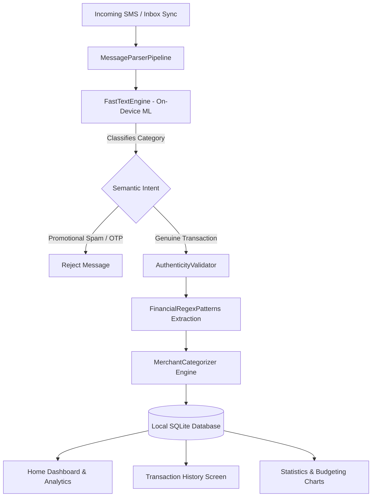

# 💸 Expense Tracker (Flutter + On-Device FastText ML)

> [!NOTE]
> 🚧 **Status: Under Active Development**  
> This application is currently under active development. Features, model weights, and UI components are continuously being updated and refined.

A modern, privacy-first, intelligent Android application for tracking personal finances. Featuring real-time automated SMS sync, **pure Dart on-device FastText machine learning classification**, smart merchant categorizer, interactive charts, and local SQLite data persistence.

---

## ✨ Features

- 🤖 **On-Device FastText ML Classifier**: High-speed (< 0.3ms latency) semantic SMS classification built natively in pure Dart. Automatically filters out promotional loan marketing, spam, and OTP security codes while isolating genuine financial transactions.
- 📩 **Automated Financial SMS Parsing**: Supports Indian banking and UPI SMS formats (HDFC, SBI, ICICI, Axis, Paytm, PhonePe, Cred, etc.) via a robust multi-tier regex pipeline and AI authenticity validator.
- 📊 **Interactive Analytics & Charts**: Powered by `fl_chart`. Visualizes spending trends, monthly budgets, and category-wise expense distributions with dynamic animations.
- 🛍️ **Smart Merchant Categorization**: Intelligent rule-based and keyword mapping engine for instant categorization (Food & Dining, Shopping, Bills & Utilities, Transport, Entertainment, Investments, etc.).
- 🔒 **100% Offline & Privacy-Centric**: No cloud server, zero remote APIs, and no native C++/Python dependencies. All SMS processing and model evaluation happens locally on your device.
- 💾 **Local SQLite Storage**: Fast, persistent storage utilizing `sqflite` for offline-first performance.
- 🎨 **Modern Material Design**: Featuring responsive bottom sheets (`SmartParserSheet`, `CategoryPickerSheet`), shimmer loading effects, custom dialogs, and smooth micro-interactions.
- 🔔 **Background & Manual SMS Sync**: Foreground sync service with explicit permission disclosure and user notifications.

---

## 🏗️ System Architecture


```mermaid
flowchart TD
    A[Incoming SMS / Inbox Sync] --> B[MessageParserPipeline]
    B --> C[FastTextEngine - On-Device ML]
    
    C -->|Classifies Category| D{Semantic Intent}
    D -->|Promotional Spam / OTP| E[Reject Message]
    D -->|Genuine Transaction| F[AuthenticityValidator]
    
    F --> G[FinancialRegexPatterns Extraction]
    G --> H[MerchantCategorizer Engine]
    H --> I[(Local SQLite Database)]
    
    I --> J[Home Dashboard & Analytics]
    I --> K[Transaction History Screen]
    I --> L[Statistics & Budgeting Charts]
```

---

## 🛠️ Technology Stack

- **Framework**: [Flutter](file:///c:/Users/santo/OneDrive/Documents/Expense_tracker/pubspec.yaml) (SDK `^3.8.1`)
- **Language**: Dart
- **Database**: `sqflite` (SQLite)
- **Charts & Visualizations**: `fl_chart`
- **SMS Reading**: `flutter_sms_inbox` & `permission_handler`
- **Notifications**: `flutter_local_notifications`
- **Machine Learning**: Custom pure-Dart **FastText** implementation (Subword n-gram hashing + SGD trained embeddings)

---

## 🧠 On-Device FastText ML Engine

The project includes a pure Dart FastText model toolchain that runs without any Python, C++, or TensorFlow binaries.

### Model Specs
- **Classes**: `GENUINE_TRANSACTION`, `PROMOTIONAL_SPAM`, `OTP_SECURITY`, `INFORMATIONAL`
- **Feature Extraction**: 3-to-6 character subword n-grams with 32-bit FNV-1a hashing into 8,192 buckets.
- **Model Footprint**: ~150 KB serialized JSON (`assets/models/financial_fasttext.json`).
- **Inference Latency**: `< 0.3ms` per message.

### Training / Re-generating Model Weights
To retrain the ML classifier on updated synthetic banking templates:

```powershell
dart run tool/train_fasttext.dart
```

This generates `assets/models/financial_fasttext.json` after running Stochastic Gradient Descent (SGD) training across 3,200+ labeled SMS templates.

---

## 🚀 Getting Started

### Prerequisites
- [Flutter SDK](https://docs.flutter.dev/get-started/install) (`>= 3.8.1`)
- Android Studio / VS Code with Flutter extension
- Android Device or Emulator (API level 21+)

### Installation & Setup

1. **Clone the repository**:
   ```bash
   git clone https://github.com/allwin-antony/Expense_tracker.git
   cd Expense_tracker
   ```

2. **Install dependencies**:
   ```bash
   flutter pub get
   ```

3. **Train / verify ML model weights** *(Optional, pre-compiled asset included)*:
   ```bash
   dart run tool/train_fasttext.dart
   ```

4. **Run the application**:
   ```bash
   flutter run
   ```

---

## 🧪 Testing

Run the full automated unit test suite covering FastText inference, SMS parser pipelines, budget calculations, and date utilities:

```bash
flutter test
```

Expected output:
```
00:00 +48: All tests passed!
```

---

## 📂 Project Structure

```
Expense_tracker/
├── assets/
│   ├── models/            # FastText ML model weights (financial_fasttext.json)
│   └── icons/             # Launcher and app icons
├── lib/
│   ├── main.dart          # App entry point & service initialization
│   ├── models/            # Expense, Category, SMS, and Budget data models
│   ├── parser/            # Regex patterns, merchant categorizer, and pipeline
│   │   └── ml/            # Pure Dart FastText engine & authenticity validator
│   ├── screens/           # Home, History, Statistics, and Main tab screens
│   ├── services/          # SQLite Database, SMS Sync, and Notifications services
│   └── widgets/           # Dialogs, bottom sheets, cards, shimmer loaders
├── tool/
│   └── train_fasttext.dart # FastText dataset generator & SGD trainer script
└── test/                  # Comprehensive unit tests for ML & parser engine
```

---

## 📄 License

This project is open-source and available under the MIT License.

