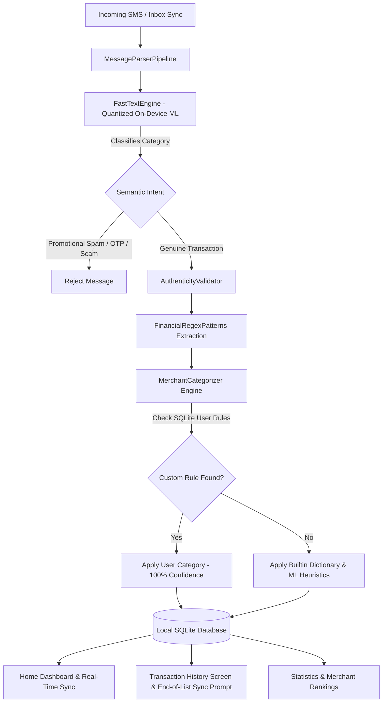

# 💸 Expense Tracker (Flutter + On-Device FastText ML)

A modern, privacy-first, intelligent Android application for tracking personal finances tailored for Indian transactions & UPI parsing. Featuring real-time automated SMS sync, **pure Dart quantized on-device FastText machine learning classification**, custom user merchant auto-learning, interactive notifications, privacy mode, merchant analytics, interactive charts, and local SQLite data persistence.

---

## ✨ Features

- 🤖 **Quantized On-Device FastText ML Classifier**: High-speed (< 0.3ms latency) semantic SMS classification built natively in pure Dart. Features uint8 Base64 quantization (**171.5 KB model size** — 83.5% size reduction). Automatically filters out promotional loan marketing, spam, and OTP security codes while isolating genuine financial transactions.
- 🔔 **Interactive Heads-Up Notifications**: Live SMS auto-capture alerts featuring **`🔕 Exclude`** and **`🗑️ Delete`** notification actions with real-time UI synchronization across the app without requiring manual pull-to-refresh.
- 📅 **End-of-List History Sync Prompt**: Automatically detects when recorded transaction history is limited (e.g. 1–3 months) and prompts users to sync broader timeframes (*Last 90 Days, This Year, or All Time*) with a single tap.
- 👁️ **Public Privacy Mode**: 1-tap Eye toggle on Home, Statistics, and History screens to obscure summary balance figures (`+₹ ••••••` / `-₹ ••••••`) in public environments.
- 🏦 **Comprehensive RBI Banks & NPCI Handles Dataset**: Trained with official lists of 712+ Indian Banks (Public, Private, Small Finance, Co-operative) and 92+ NPCI UPI/AutoPay handles (`@ybl`, `@okaxis`, `@oksbi`, `@okhdfcbank`, `@apl`, `@fkaxis`, `@jupiteraxis`, `@wasbi`, etc.).
- 🛍️ **Custom User Merchant Rules (Dynamic Learning Engine)**: Remembers and auto-applies custom merchant categorizations (e.g. mapping local store *"Sharma Dhaba"* $\rightarrow$ *"Food & Dining"*) in local SQLite storage. User custom rules take 100% precedence in both manual entries and automated SMS syncs.
- 📊 **Interactive Analytics & Merchant Rankings**: Powered by `fl_chart`. Toggle between **By Category** pie charts and **By Merchant** top spending rankings with Gold (🥇 #1), Silver (🥈 #2), and Bronze (🥉 #3) badges, order frequencies, and spending percentages.
- 📆 **Redesigned Date Range Picker & Explicit Headers**: Detailed Date/Month timestamps (`DateFormat('d MMM, h:mm a')`) and date-tagged group headers (`Today • 14 Aug`) for full clarity while scrolling.
- 📩 **Intelligent Financial SMS Parsing (Multi-Sentence Scoper)**: Powered by a multi-tier regex pipeline with **ClauseSemanticScoper** that splits sentences and scopes extraction strictly to transaction event clauses, preventing balance-amount confusion. Handles complex banking SMS formats (HDFC, SBI, ICICI, Axis, EPFO, mutual funds, etc.).
- 🛡️ **Anti-Fraud Security Shield & Sender ID Check**: Enforces official **TRAI alphanumeric headers** (ignores personal mobile numbers to prevent spoofing/pranks) and automatically rejects spam/phishing baits (KYC block threats, fake lotteries, utility deactivations, work-from-home offers, and APK malware links) via `scamFilterRegex`.
- 💱 **Multi-Currency Processing**: Supports **USD ($), GBP (£), and EUR (€)** transaction parsing for international subscriptions (AWS, Netflix US, OpenAI) and foreign travel.
- 🔒 **100% Offline & Privacy-Centric**: Zero cloud servers, zero remote APIs, and no native C++/Python binaries. All processing runs locally on device.
- 📱 **Multi-Target Architecture Release APKs**: Optimized builds split per ABI target (`arm64-v8a`, `armeabi-v7a`, `x86_64`) with Java 11 desugaring and icon tree-shaking.

---

## 🏗️ System Architecture


```mermaid
flowchart TD
    A[Incoming SMS / Inbox Sync] --> B[MessageParserPipeline]
    B --> C[FastTextEngine - Quantized On-Device ML]
    
    C -->|Classifies Category| D{Semantic Intent}
    D -->|Promotional Spam / OTP / Scam| E[Reject Message]
    D -->|Genuine Transaction| F[AuthenticityValidator]
    
    F --> G[FinancialRegexPatterns Extraction]
    G --> H[MerchantCategorizer Engine]
    H -->|Check SQLite User Rules| I{Custom Rule Found?}
    I -->|Yes| J[Apply User Category - 100% Confidence]
    I -->|No| K[Apply Builtin Dictionary & ML Heuristics]
    
    J --> L[(Local SQLite Database)]
    K --> L
    
    L --> M[Home Dashboard & Real-Time Sync]
    L --> N[Transaction History Screen & End-of-List Sync Prompt]
    L --> O[Statistics & Merchant Rankings]
```

---

## 🛠️ Technology Stack

- **Framework**: [Flutter](pubspec.yaml) (SDK `^3.8.1`)
- **Language**: Dart
- **Database**: `sqflite` (SQLite v5 schema with `custom_merchant_rules`)
- **Charts & Visualizations**: `fl_chart`
- **SMS Reading**: `flutter_sms_inbox` & `permission_handler`
- **Notifications**: `flutter_local_notifications` (Interactive foreground & background actions)
- **Machine Learning**: Custom pure-Dart **FastText** implementation (Subword n-gram hashing + SGD trained embeddings + uint8 Base64 quantization)

---

## 🧠 On-Device FastText ML Engine

The project includes a pure Dart FastText model toolchain that runs without any Python, C++, or TensorFlow binaries.

### Model Specs
- **Classes**: `GENUINE_TRANSACTION`, `PROMOTIONAL_SPAM`, `OTP_SECURITY`, `INFORMATIONAL`
- **Feature Extraction**: 3-to-6 character subword n-grams with 32-bit FNV-1a hashing into 8,192 buckets.
- **Quantization**: 8-bit unsigned integer Base64 quantization with scaling parameters (`embMin`, `embMax`).
- **Model Size**: **`171.5 KB`** (reduced from `1.03 MB`).
- **Inference Latency**: `< 0.3ms` per message.

### Training / Re-generating Model Weights
To retrain the ML classifier on updated synthetic banking templates:

```powershell
dart run tool/train_fasttext.dart
```

This generates `assets/models/financial_fasttext.json` after running Stochastic Gradient Descent (SGD) training across 3,200+ labeled SMS templates with automatic uint8 Base64 quantization export.

---

## 📦 Release APK Targets

Build production APKs for all target architectures:

```bash
flutter build apk --release --split-per-abi
```

- **ARM 64-bit (`arm64-v8a`)**: `build/app/outputs/flutter-apk/app-arm64-v8a-release.apk`
- **ARM 32-bit (`armeabi-v7a`)**: `build/app/outputs/flutter-apk/app-armeabi-v7a-release.apk`
- **x86 64-bit (`x86_64`)**: `build/app/outputs/flutter-apk/app-x86_64-release.apk`

---

## 🚀 Getting Started

### Prerequisites
- [Flutter SDK](https://docs.flutter.dev/get-started/install) (`>= 3.8.1`)
- Android Studio / VS Code with Flutter extension
- Android Device or Emulator (API level 21+)

### Installation & Setup

1. **Clone the repository**:
   ```bash
   git clone https://github.com/allwin-antony/Expense_tracker.git
   cd Expense_tracker
   ```

2. **Install dependencies**:
   ```bash
   flutter pub get
   ```

3. **Run the application**:
   ```bash
   flutter run
   ```

---

## 🧪 Testing

Run the full automated unit test suite covering FastText inference, Clause Semantic Scoping, TRAI header checks, SMS parser pipelines, custom merchant rules, merchant analytics, budget calculations, and date utilities:

```bash
flutter test
```

Expected output:
```
00:17 +202: All tests passed!
```

---

## 📄 License

This project is open-source and available under the MIT License.
