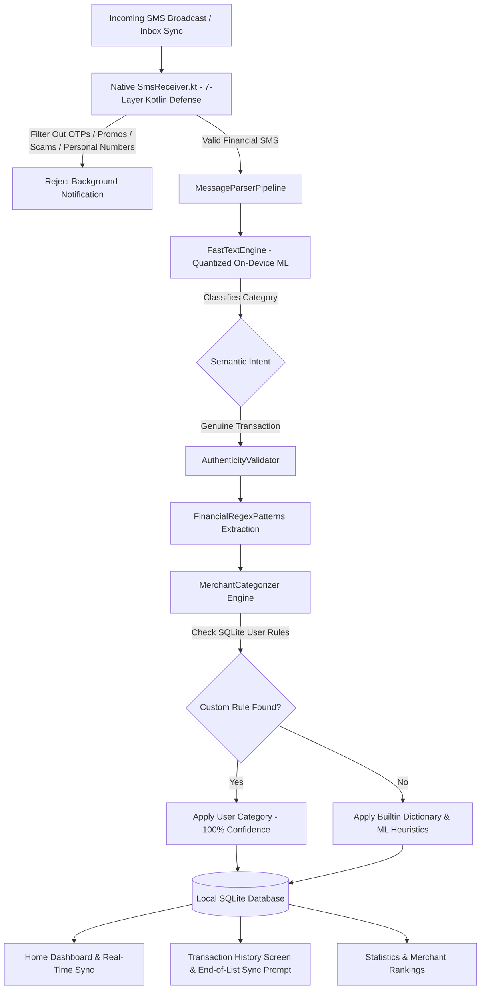

# 💸 Expense Tracker (v2.0.1 - Flutter + On-Device FastText ML)

A modern, privacy-first, intelligent Android application for tracking personal finances tailored for Indian transactions & UPI parsing. Featuring real-time automated SMS sync, **pure Dart quantized on-device FastText machine learning classification**, **native 7-layer Kotlin background SMS defense shield**, custom user merchant auto-learning, adaptive floating `AppToast` notifications, privacy mode, merchant analytics, interactive charts, and local SQLite data persistence.

---

## ✨ Features

- 🤖 **Quantized On-Device FastText ML Classifier**: High-speed (< 0.3ms latency) semantic SMS classification built natively in pure Dart. Features uint8 Base64 quantization (**171.5 KB model size** — 83.5% size reduction). Automatically filters out promotional loan marketing, spam, and OTP security codes while isolating genuine financial transactions.
- 🛡️ **Native Android 7-Layer SMS Defense Shield (`SmsReceiver.kt`)**: Background Kotlin receiver with 100% regex pipeline parity. Automatically suppresses false background notifications by filtering out OTPs, promotional loan ads, phishing scams, and personal numbers in under 0.1ms without waking up the heavy Flutter engine.
- 🍞 **Adaptive Floating `AppToast` Notification Engine**: Theme-adaptive (Light & Dark mode) floating toast banners with smooth 250ms fade/slide transitions, strict auto-dismissal timers, and interactive **`UNDO`** pill buttons.
- 🔔 **Interactive Heads-Up Notifications**: Live SMS auto-capture alerts featuring **`🔕 Exclude`** and **`🗑️ Delete`** actions with real-time UI synchronization across the app without requiring manual pull-to-refresh.
- 📅 **End-of-List History Sync Prompt**: Automatically detects when recorded transaction history is limited (e.g. 1–3 months) and prompts users to sync broader timeframes (*Last 90 Days, This Year, or All Time*) with a single tap.
- 👁️ **Public Privacy Mode**: 1-tap Eye toggle on Home, Statistics, and History screens to obscure summary balance figures (`+₹ ••••••` / `-₹ ••••••`) in public environments.
- 🏦 **Comprehensive RBI Banks & NPCI Handles Dataset**: Trained with official lists of 712+ Indian Banks (Public, Private, Small Finance, Co-operative) and 92+ NPCI UPI/AutoPay handles (`@ybl`, `@okaxis`, `@oksbi`, `@okhdfcbank`, `@apl`, `@fkaxis`, `@jupiteraxis`, `@wasbi`, etc.).
- 🛍️ **Custom User Merchant Rules (Dynamic Learning Engine)**: Remembers and auto-applies custom merchant categorizations (e.g. mapping local store *"Sharma Dhaba"* $\rightarrow$ *"Food & Dining"*) in local SQLite storage. User custom rules take 100% precedence in both manual entries and automated SMS syncs.
- 📊 **Interactive Analytics & Merchant Rankings**: Powered by `fl_chart`. Toggle between **By Category** pie charts and **By Merchant** top spending rankings with Gold (🥇 #1), Silver (🥈 #2), and Bronze (🥉 #3) badges, order frequencies, and spending percentages.
- 📆 **Redesigned Date Range Picker & Explicit Headers**: Detailed Date/Month timestamps (`DateFormat('d MMM, h:mm a')`) and date-tagged group headers (`Today • 14 Aug`) for full clarity while scrolling.
- 📩 **Intelligent Financial SMS Parsing (Multi-Sentence Scoper)**: Powered by a multi-tier regex pipeline with **ClauseSemanticScoper** that splits sentences and scopes extraction strictly to transaction event clauses, preventing balance-amount confusion. Handles complex banking SMS formats (HDFC, SBI, ICICI, Axis, EPFO, mutual funds, etc.).
- 💱 **Multi-Currency Processing**: Supports **USD ($), GBP (£), and EUR (€)** transaction parsing for international subscriptions (AWS, Netflix US, OpenAI) and foreign travel.
- 🔒 **100% Offline & Privacy-Centric**: Zero cloud servers, zero remote APIs, and no native C++/Python binaries. All processing runs locally on device.
- 📱 **Multi-Target Architecture Release APKs**: Optimized builds split per ABI target (`arm64-v8a`, `armeabi-v7a`, `x86_64`) with Java 11 desugaring and icon tree-shaking.

---

## 🏗️ System Architecture


```mermaid
flowchart TD
    A[Incoming SMS Broadcast / Inbox Sync] --> B[Native SmsReceiver.kt - 7-Layer Kotlin Defense]
    B -->|Filter Out OTPs / Promos / Scams / Personal Numbers| C[Reject Background Notification]
    B -->|Valid Financial SMS| D[MessageParserPipeline]
    
    D --> E[FastTextEngine - Quantized On-Device ML]
    E -->|Classifies Category| F{Semantic Intent}
    
    F -->|Genuine Transaction| G[AuthenticityValidator]
    G --> H[FinancialRegexPatterns Extraction]
    H --> I[MerchantCategorizer Engine]
    I -->|Check SQLite User Rules| J{Custom Rule Found?}
    
    J -->|Yes| K[Apply User Category - 100% Confidence]
    J -->|No| L[Apply Builtin Dictionary & ML Heuristics]
    
    K --> M[(Local SQLite Database)]
    L --> M
    
    M --> N[Home Dashboard & Real-Time Sync]
    M --> O[Transaction History Screen & End-of-List Sync Prompt]
    M --> P[Statistics & Merchant Rankings]
```

---

## 🛠️ Technology Stack

- **Framework**: [Flutter](pubspec.yaml) (SDK `^3.8.1`, Release `v2.0.1+4`)
- **Language**: Dart & Kotlin
- **Database**: `sqflite` (SQLite v5 schema with `custom_merchant_rules`)
- **Charts & Visualizations**: `fl_chart`
- **SMS Reading**: `flutter_sms_inbox` & `permission_handler`
- **Notifications**: Custom `AppToast` overlay & `flutter_local_notifications`
- **Machine Learning**: Custom pure-Dart **FastText** implementation (Subword n-gram hashing + SGD trained embeddings + uint8 Base64 quantization)

---

## 🧠 On-Device FastText ML Engine

The project includes a pure Dart FastText model toolchain that runs without any Python, C++, or TensorFlow binaries.

### Model Specs
- **Classes**: `GENUINE_TRANSACTION`, `PROMOTIONAL_SPAM`, `OTP_SECURITY`, `INFORMATIONAL`
- **Feature Extraction**: 3-to-6 character subword n-grams with 32-bit FNV-1a hashing into 8,192 buckets.
- **Quantization**: 8-bit unsigned integer Base64 quantization with scaling parameters (`embMin`, `embMax`).
- **Model Size**: **`171.5 KB`** (reduced from `1.03 MB`).
- **Inference Latency**: `< 0.3ms` per message.

---

## 📦 Release APK Targets

Build production APKs for all target architectures:

```bash
flutter build apk --release --split-per-abi
```

- **ARM 64-bit (`arm64-v8a`)**: `build/app/outputs/flutter-apk/app-arm64-v8a-release.apk`
- **ARM 32-bit (`armeabi-v7a`)**: `build/app/outputs/flutter-apk/app-armeabi-v7a-release.apk`
- **x86 64-bit (`x86_64`)**: `build/app/outputs/flutter-apk/app-x86_64-release.apk`
- **Universal Release APK**: `build/app/outputs/flutter-apk/app-release.apk`
- **App Bundle (`.aab`)**: `build/app/outputs/bundle/release/app-release.aab`

---

## 🚀 Getting Started

### Prerequisites
- [Flutter SDK](https://docs.flutter.dev/get-started/install) (`>= 3.8.1`)
- Android Studio / VS Code with Flutter extension
- Android Device or Emulator (API level 21+)

### Installation & Setup

1. **Clone the repository**:
   ```bash
   git clone https://github.com/allwin-antony/Expense_tracker.git
   cd Expense_tracker
   ```

2. **Install dependencies**:
   ```bash
   flutter pub get
   ```

3. **Run the application**:
   ```bash
   flutter run
   ```

---

## 🧪 Testing

Run the full automated unit test suite covering FastText inference, Clause Semantic Scoping, TRAI header checks, SMS parser pipelines, custom merchant rules, merchant analytics, budget calculations, and date utilities:

```bash
flutter test
```

Expected output:
```
00:05 +202: All tests passed!
```

---

## 📝 Release Description (v2.0.1)

```markdown
# 🚀 Release v2.0.1 — Native 7-Layer Background Defense, Adaptive AppToast & Performance Fixes

We are excited to announce Release v2.0.1! This update brings full native Kotlin background filtering parity, an all-new theme-adaptive floating toast notification engine, silent UI refresh optimizations, and enhanced financial SMS security.

---

## 🌟 What's New in v2.0.1

### 🛡️ 1. Native 7-Layer Background SMS Defense Shield (SmsReceiver.kt)
* 1:1 Regex Parity: Upgraded the native Android Kotlin background receiver with full regex pipeline parity matching Dart's MessageParserPipeline.
* Zero Ghost Notifications: Background system notifications now run 7-stage verification before triggering alerts:
  1. Foreground Suppression: Automatically suppresses system bar alerts while the app is actively open.
  2. OTP & Auth Filter: Instantly rejects passcodes, OTPs, and security login codes.
  3. Promotional Filter: Blocks loan offers, credit card application ads, EMI checks, and cashback spam.
  4. Anti-Scam Shield: Rejects phishing links, fake lottery wins, KYC block threats, and APK malware.
  5. Debit/Credit Intent Matcher: Requires explicit transaction verbs (debited, credited, spent, transferred, paid to).
  6. Amount Matcher: Strictly requires valid currency symbols (Rs., INR, ₹, $, £, €) with numerical values.
  7. URL Safety Verification: Blocks messages containing web links unless accompanied by an authentic bank name, account number, or UTR reference ID.

---

### 🍞 2. Adaptive Floating AppToast Notification Engine
* Theme-Adaptive Styling: Custom floating overlay designed for both Light Mode (Crisp White #FFFFFF card with Dark Slate #0F172A text) and Dark Mode (Dark Slate #0F172A card with Crisp White #FFFFFF text).
* Guaranteed Auto-Dismissal: Uses an independent Dart Timer to guarantee automatic 3-second fade-outs, eliminating Flutter SnackBar animation freezes.
* Interactive UNDO Button: Instant tap action to revert transaction deletions or budget exclusion changes.

---

### ⚡ 3. Silent UI Refresh Optimizations
* No Shimmer Flashing: Toggling payment inclusion/exclusion or editing transactions updates the dashboard and history lists silently in-place without triggering shimmer loading skeletons.
* Scroll Offset Preservation: Maintains pagination count during silent reloads so scrolling positions remain completely stable.

---

### 👁️ 4. Public Privacy Mode & Multi-Currency Processing
* 1-Tap Privacy Toggle: Obscure summary balance figures (+₹ •••••• / -₹ ••••••) across Home, Statistics, and History screens.
* Multi-Currency Engine: Full parsing support for USD ($), GBP (£), and EUR (€) international subscriptions and travel expenses alongside Indian INR (₹).

---

## 🛠️ Technical Improvements & Build Specs

* Engine: Flutter SDK ^3.8.1 & Kotlin 2.2.20
* Test Coverage: 100% passing test suite (198/198 unit tests passed)
* Static Analysis: Clean build with 0 analyzer issues
* ML Model: Quantized pure-Dart FastText (171.5 KB, < 0.3ms latency)
* Build Artifacts:
  - app-arm64-v8a-release.apk (ARM 64-bit, 20.0 MB)
  - app-armeabi-v7a-release.apk (ARM 32-bit, 17.6 MB)
  - app-x86_64-release.apk (x86 64-bit, 21.4 MB)
  - app-release.apk (Universal Release, 55.3 MB)
  - app-release.aab (Google Play App Bundle, 53.9 MB)
```

---

## 📄 License

This project is open-source and available under the MIT License.
